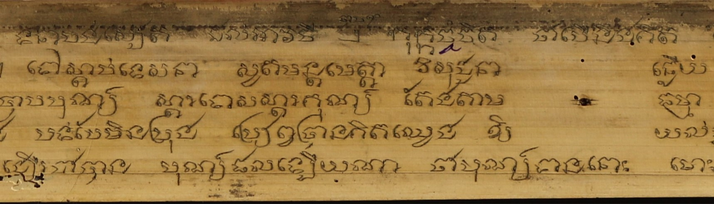

# Khmer Historical Text Restoration

## Introduction

This repository presents a document image restoration framework specifically designed to preserve Cambodia's invaluable historical Khmer palm leaf manuscripts. These manuscripts, holding profound cultural and religious significance, are often severely degraded due to various factors like age, environmental conditions, and historical conflicts. This project leverages advanced computer vision and deep learning techniques to automatically restore these deteriorated manuscript images.

## Abstract

This research introduces a document image restoration framework aimed at preserving Cambodia’s historical Khmer palm leaf manuscripts through the application of computer vision and deep learning techniques. These manuscripts, which hold immense cultural and religious significance, often suffer from heavy degradation due to age, environmental conditions, and historical conflict. To address this, we explore three advanced neural network architectures—U-Net, Attention U-Net, and Residual Attention U-Net—for the automatic restoration of these deteriorated manuscript images. Since no standard ground truth dataset exists for this purpose, we constructed a custom dataset by manually generating ground truth images for both training and evaluation. A patch-based approach was adopted, extracting 48×48 and 64×64 pixel patches from a set of 20 manuscripts, with 14 used for training and 6 reserved for evaluation. We compared the performance of these U-Net variants against convolutional autoencoders and a conditional Generative Adversarial Network (cGAN), using quantitative metrics such as Mean Squared Error (MSE), Peak Signal-to-Noise Ratio (PSNR), and Structural Similarity Index Measure (SSIM). The results show that Residual Attention U-Net achieves the best performance on 48×48 patches, while both the cGAN and standard U-Net demonstrate notable improvements on 64×64 patches, highlighting the effectiveness of U-Net-based architectures for noise reduction and visual restoration.

## Methodology

This project explores and compares various deep learning architectures for image restoration:

* **U-Net**
* **Attention U-Net**
* **Residual Attention U-Net**
* **Convolutional Autoencoders**
* **Conditional Generative Adversarial Network (cGAN)**

### Dataset

Due to the absence of a standard ground truth dataset for Khmer palm leaf manuscript restoration, a custom dataset was meticulously created. This involved:

* Manually generating ground truth images for both training and evaluation.
* Extracting 48×48 and 64×64 pixel patches from a collection of 20 manuscripts.
* Utilizing 14 manuscripts for training and reserving 6 for evaluation.

### Evaluation Metrics

The performance of the models was quantitatively assessed using the following metrics:

* **Mean Squared Error (MSE)**
* **Peak Signal-to-Noise Ratio (PSNR)**
* **Structural Similarity Index Measure (SSIM)**

## Results

The research yielded the following key findings:

* **Residual Attention U-Net** demonstrated the best performance when applied to 48×48 patches.
* For 64×64 patches, both **cGAN** and the standard **U-Net** showed significant improvements.
* Overall, U-Net-based architectures proved highly effective for noise reduction and visual restoration of the deteriorated manuscript images.

### Table 1: Average performance metrics (MSE, PSNR, SSIM) of all models trained on 48×48 patch size data.

| Model                      | MSE    | PSNR (dB) | SSIM (%) |
|---------------------------|--------|-----------|----------|
| Syuhada’s CAE             | 0.0434 | 22.3168   | 77.85    |
| Pork’s CAE                | 0.0386 | 22.7620   | 81.95    |
| Pork’s Pix2Pix            | 0.0554 | 24.0987   | 82.10    |
| U-Net                     | 0.0447 | 25.6150   | 83.85    |
| Attention U-Net           | 0.0441 | 26.5290   | 84.81    |
| Residual Attention U-Net  | 0.0429 | 28.7033   | 85.51    |

### Table 2. Average performance metrics (MSE, PSNR, SSIM) of all models trained on 64×64 patch size data.

| Model                      | MSE    | PSNR (dB) | SSIM (%) |
|---------------------------|--------|-----------|----------|
| Syuhada’s CAE             | 0.0454 | 19.3958   | 76.24    |
| Pork’s CAE                | 0.0410 | 19.3066   | 79.21    |
| Pork’s Pix2Pix            | 0.0608 | 29.1561   | 81.77    |
| U-Net                     | 0.0409 | 25.1801   | 85.97    |
| Attention U-Net           | 0.0407 | 23.5066   | 85.07    |
| Residual Attention U-Net  | 0.0399 | 21.9758   | 84.63    |


### Qualitative Comparison

| Original Image | Restored Image |
|----------------|----------------|
|  |  |
|  |  |
|  |  |

## Getting Started

To get a local copy up and running, follow these simple steps.

### Prerequisites

* Python (version 3.11.X)
* pip

### Installation

1.  Clone the repo:
    ```bash
    git clone [https://github.com/NDarayut/Khmer-Historical-Text-Restoration.git](https://github.com/NDarayut/Khmer-Historical-Text-Restoration.git)
    ```
2.  Navigate to the project directory:
    ```bash
    cd Khmer-Historical-Text-Restoration
    ```
3.  Install required Python packages (you might need to create a `requirements.txt` file in your repository if you don't have one, listing all dependencies):
    ```bash
    pip install -r requirements.txt
    ```

### Usage

#### Inference Example

To run inference on a test image using the trained Attention Residual U-Net model:

1. Make sure your trained model is saved at the correct path:

2. Place your input test image (RGB and Grayscale versions) at the specified path, e.g.:

3. Then, run the `test.py` script:
```bash
python test.py
```

## Data Availibility
This research utilizes the SleukRith Set, a publicly available dataset of Khmer palm leaf manuscripts compiled from original digitization efforts and existing digital archives. The dataset comprises 657 annotated manuscript pages and includes three types of data: isolated character images, annotated word datasets, and line segmentation ground truth. The dataset and the accompanying annotation tool are openly accessible at: https://github.com/donavaly/SleukRith-Set. 

## License
Distributed under the MIT License. See LICENSE for more information. (If you have a LICENSE file in your repository, otherwise specify your chosen license).